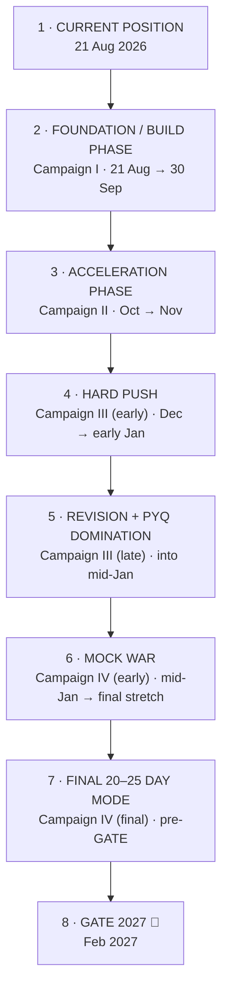
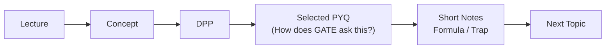
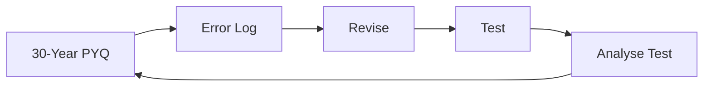
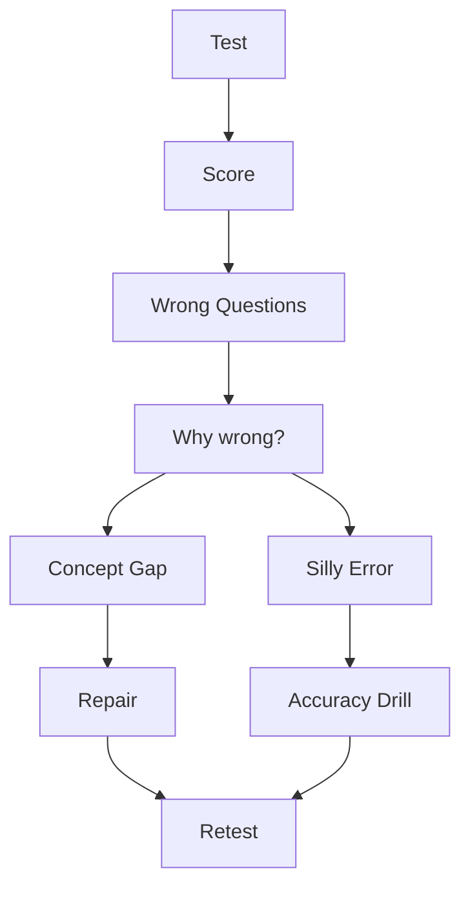

# GATE 2027 — WAR MAP
### `21 AUG 2026 → GATE 2027 (FEB 2027)`

> **कर्मण्येवाधिकारस्ते मा फलेषु कदाचन**
> Main competition se nahi lad raha. Main apne kal wale version ko obsolete bana raha hoon.

---

## 00 — Mission

Convert the remaining ~6 months into a controlled climb:

```
SYLLABUS  →  PYQ PATTERNS  →  TESTS  →  RANK
```

Two non-negotiable, permanently-running tracks sit underneath every phase below:

```
GATE CORE
   │
   ├── Academic / GATE subjects   (this document's main focus)
   └── DSA / Coding                (protected — never paused, see §09)
```

University semester and GATE are not enemies (§10). Badly scheduled, they compete for the same hours. Properly scheduled, they reinforce each other.

---

## 01 — Current Position

**Date:** 21 Aug 2026 · **Year:** 3rd year, semester running · **Exam:** GATE 2027, Feb 2027

```
                    🏁 GATE 2027
                         ▲
                         │
                  MOCK + EXECUTE
                         ▲
                         │
                  PYQ MASTERY
                         ▲
                         │
                 SYLLABUS COMPLETE
                         ▲
                         │
                  BUILD THE PACE
                         ▲
                         │
                  🔥 YOU ARE HERE
```

You are at the base of the climb, in the pace-building window (21 Aug → 30 Sep). Nothing about this position is behind schedule — it's the designed starting point.

---

## 02 — The Battlefield

Subject status as of 21 Aug 2026 (data from your tracker, not invented):

| Territory | Coverage | State | Move |
|---|---:|---|---|
| 🧩 DSA | 100% | Captured | Maintain via PYQ + coding (protected track) |
| 💻 C Programming | 74% | Substantially covered | Consolidate |
| 🔌 Digital Logic | 54% | In progress | 🔥 Finish now |
| 🌐 Computer Networks | 22% | In progress | 🔥 Continue |
| 📐 Discrete Maths | 14% | Barely started | Gradual (side quest) |
| 🎯 Aptitude | 4% | Barely started | Maintain |
| 🧮 Calculus | 3% | Barely started | Gradual (side quest) |
| 🖥️ OS | 1% | Barely started | Start |
| ⚙️ Algorithms | 1% | Barely started | Build |
| 🗄️ DBMS | 0% | Untouched | Capture later |
| 🏗️ COA | 0% | Untouched | College + PW alignment |
| 🧠 TOC | 0% | Untouched | Capture |
| 🛠️ Compiler Design | 0% | Untouched | Capture |
| 🎲 Probability | 0% | Untouched | Maths block |
| 📊 Linear Algebra | 0% | Untouched | Maths block |

> **0% ≠ failure. It means territory not captured yet.** Four states exist on this board: **captured, progressing, barely started, untouched.** The plan below moves every subject through them in order — nothing starts pretending it's already mid-fight.

---

## 03 — Six-Month Campaign Map



| # | Phase | Window | One-line objective |
|---|---|---|---|
| 1 | Current Position | 21 Aug 2026 | Know exactly where you stand |
| 2 | Foundation / Build | 21 Aug → 30 Sep | Pace + first-pass strength on weak subjects |
| 3 | Acceleration | Oct → Nov | First-pass syllabus completes; topic-wise PYQ begins |
| 4 | Hard Push | Dec → early Jan | 30-year PYQ + subject tests + error analysis start |
| 5 | Revision + PYQ Domination | into mid-Jan | Mixed PYQ, compression, pattern recognition |
| 6 | Mock War | mid-Jan → final stretch | Full-length mocks become dominant activity |
| 7 | Final 20–25 Day Mode | pre-GATE | No new resources — pure conversion to marks |
| 8 | GATE 2027 | Feb 2027 | Execute |

---

## 04 — Current Phase: Campaign I — Build the Engine
### `21 AUG → 30 SEP`

**Goal:** Pace + first-pass strength. Not perfection — usable coverage.

**Attack order:**

```
DIGITAL LOGIC
     ↓
COMPUTER NETWORKS
     ↓
OPERATING SYSTEMS
     ↓
COMPILER DESIGN
     ↓
ALGORITHMS
     ↓
COA  (when PW starts / college alignment permits)
```

**Side quest — Mathematics (45–60 min/day, parallel, not blocking):**

```
45–60 min/day → DM / Probability / Linear Algebra / Calculus
```

**Phase gate to exit Campaign I (checked ~30 Sep):**
- Digital Logic and Computer Networks moved from "in progress" to "substantially covered"
- OS, Compiler, Algorithms have a real first touch (no longer 0–1%)
- Maths side quest has been running daily, even if coverage is still low
- DSA maintained via PYQ/coding, not restarted

**Rule:** Do not chase perfection. Chase usable coverage.

---

## 05 — Subject Attack Order (Live Priority Queue)

Ordered by urgency, not alphabet — this is the queue to look at when deciding "what do I study next":

```
[███████████████████░] DSA               100%  → maintain only
[██████████████░░░░░░] C Programming       74%  → consolidate
[███████████░░░░░░░░░] Digital Logic       54%  → 🔥 finish now
[████░░░░░░░░░░░░░░░░] Computer Networks   22%  → 🔥 continue
[███░░░░░░░░░░░░░░░░░] Discrete Maths      14%  → gradual
[█░░░░░░░░░░░░░░░░░░░] Aptitude             4%  → maintain
[█░░░░░░░░░░░░░░░░░░░] Calculus             3%  → gradual
[░░░░░░░░░░░░░░░░░░░░] OS                   1%  → start
[░░░░░░░░░░░░░░░░░░░░] Algorithms           1%  → build
[░░░░░░░░░░░░░░░░░░░░] DBMS                 0%  → capture later
[░░░░░░░░░░░░░░░░░░░░] COA                  0%  → college + PW alignment
[░░░░░░░░░░░░░░░░░░░░] TOC                  0%  → capture
[░░░░░░░░░░░░░░░░░░░░] Compiler Design      0%  → capture
[░░░░░░░░░░░░░░░░░░░░] Probability          0%  → maths block
[░░░░░░░░░░░░░░░░░░░░] Linear Algebra       0%  → maths block
```

**Reading order for the next 6 weeks:** Digital Logic → Computer Networks → OS → Compiler → Algorithms → COA, with maths ticking in the background and DSA/C on maintenance.

---

## 06 — Lecture → DPP → PYQ → Revision Pipeline

This is the **one flow** every new topic goes through, every time, no exceptions:



**Later in the timeline (Campaign III onward), the loop upgrades to:**



The first loop builds the subject. The second loop builds the score. You don't switch loops early, and you don't stay on the first loop too long — the switch happens as each subject finishes its first pass, not on a fixed calendar date for all subjects at once.

---

## 07 — PYQ Domination System

PYQ is not a question bank. It's how you decode what GATE actually rewards:

```
                 PYQ
                  │
       ┌──────────┼──────────┐
       ▼          ▼          ▼
    PATTERN     TRAP       DEPTH
       │          │          │
       └──────────┼──────────┘
                  ▼
          GATE QUESTION DNA
```

**Tagging system, applied consistently from Campaign II onward:**

| Tag | Meaning |
|---|---|
| ⭐ | Repeated concept |
| ⭐⭐ | Important pattern |
| ⭐⭐⭐ | High-value GATE pattern |
| ⚠️ | Trap / recurring mistake |

**PYQs are never postponed to the end.** They exist in three distinct modes, and mixing these up is the most common way students waste PYQ value:

| Mode | When | Purpose |
|---|---|---|
| **Learning-phase PYQs** (selected) | During Campaign I–II, right after each topic | Calibration — "how does GATE actually ask this?" |
| **Semester-end PYQ marathon** (30-year) | Campaign III, once first-pass syllabus is done | Mastery — full-depth pattern coverage per subject |
| **Final mixed PYQ revision** | Campaign IV | Compression — repeated patterns + your own recurring mistakes only |

---

## 08 — Test Series Deployment

Tests are sequenced so they never fight university exams for the same week.

```
Campaign I  (Aug–Sep)   → No formal tests. DPP + selected PYQ only.
Campaign II (Oct–Nov)   → Light, topic-wise testing begins, tied to finished subjects.
Campaign III(Dec–midJan)→ Serious testing: subject tests + mixed tests, in parallel with
                           30-year PYQ. This is where error analysis becomes routine.
Campaign IV (mid-Jan→)  → Full-length mocks become the dominant activity.
Final 20–25 days        → Mocks taper toward the end; final revision + error book take over.
```

**The test loop (non-negotiable after every single test):**



> A mock without analysis is entertainment. Analysis is where the marks are created.

---

## 09 — DSA Parallel Track (Protected)

DSA is already at 100% first-pass coverage. It does not compete with GATE subjects for attention — it runs alongside, permanently, on maintenance mode:

```
                 DSA
                  │
         ┌────────┴────────┐
         ▼                 ▼
    GATE DSA           CODING DSA
         │                 │
      PYQs             LeetCode
      Patterns          Problems
      Revision          Implementation
         │                 │
         └────────┬────────┘
                  ▼
             PROBLEM SOLVER
```

**Rule:** Never restart 100% DSA without evidence of a real gap (a repeated wrong answer, a specific weak pattern in a test). Maintenance, not re-learning.

**Minimum standard, even on a bad day:** GATE gets meaningful progress, DSA gets meaningful coding/PYQ progress, and any scheduled project gets progress. All three, every day — the bar is low, but it doesn't move to zero.

---

## 10 — University Exam Survival Protocol

College and GATE reinforce each other when sequenced correctly:

```
COLLEGE                     GATE
   │                          │
Semester understanding    PYQ + pattern
+ CGPA                    recognition
   │                          │
   └──────────► PW ◄──────────┘
              (bridges both)
```

**During university exam weeks:**

```
CGPA PRIORITY      ↑ (temporarily primary)
GATE MAINTENANCE   ↓ (reduced, not zero)
```

**Non-negotiable floor during exam weeks:** GATE never becomes zero. Even a reduced touch (PYQ revision, error log review) keeps the track alive.

**Immediately after university exams end:** Back to full GATE mode — no gradual re-entry, no "easing back in" week.

---

## 11 — Recovery Protocol When Behind

Derived directly from the system's own standing rules — this is what "getting back on track" means in this plan, not a generic pep talk:

```
Behind on a subject?
        │
        ▼
Is it one bad day?  ──Yes──► Allowed. Resume tomorrow, no compensation cramming.
        │
        No (a bad week)
        ▼
Apply the anti-waste filter:
   • Cut to ONE primary source for the lagging subject
   • Drop "beautiful notes" — short notes only
   • Chase usable coverage, not perfect coverage
   • Do not restart anything already at 100% (DSA) without evidence of a gap
   • Do not add a new teacher/resource to "fix" the lag
        │
        ▼
Re-enter the pipeline (§06) at the correct stage — don't skip PYQ to "catch up faster"
```

> One bad day is allowed. One bad week is not.

---

## 12 — Monthly Checkpoints

Qualitative, not fabricated numeric targets — each checkpoint is the exit condition for that campaign:

| Checkpoint | Window | What must be true |
|---|---|---|
| End Sep | Close of Campaign I | Digital Logic + Computer Networks substantially covered; OS, Compiler, Algorithms have a real first touch; maths side quest active; DSA/C on maintenance only |
| End Nov | Close of Campaign II | First-pass syllabus captured across active subjects; topic-wise PYQ with tagging (§07) is routine; weaknesses are being repaired as found, not stockpiled |
| Mid-Jan | Close of Campaign III | 30-year PYQ pass done per subject; subject + mixed tests running with error analysis after every one; revision cycle active |
| Pre-final stretch | Start of Campaign IV | Full mocks are the dominant activity; error book exists and is being used, not just kept |

---

## 13 — Final 30 Days

Extension of Campaign IV's own rules, applied tightly:

```
🚫 NO RESOURCE HOPPING
🚫 NO GIANT NEW COURSES
🚫 NO PANIC LEARNING

            ↓

      FULL MOCKS
            ↓
      MOCK ANALYSIS
            ↓
      ERROR BOOK
            ↓
      PYQ PATTERNS
            ↓
      FINAL REVISE
```

Everything you engage with in these 30 days is something you've already touched before. Nothing new enters the system.

---

## 14 — Final 7 Days

Same pipeline, compressed further — mocks taper, revision dominates:

```
Day -7 to -4   → Last full mock(s) + analysis. Close remaining error-book items.
Day -3 to -2   → Pure revision: short notes, formula sheets, ⭐⭐⭐ / ⚠️ tagged PYQs only.
Day -1         → Light review only. No new problems. Logistics check (admit card, exam
                 center, ID, stationery). Protect sleep.
```

---

## 15 — Exam-Day Protocol

```
Before  → Known logistics only (admit card, ID, center, reporting time).
          No revision that could shake confidence. No comparing notes with others.
During  → Attempt in order of confidence, not question order.
          Flag-and-move on anything that stalls recall past a short window.
          Trust the pattern recognition built over 6 months — don't re-derive from
          scratch what PYQ practice already made automatic.
After   → No autopsy before the next section/paper if multi-session.
          Full autopsy only after the exam is completely over.
```

---

## 16 — Rules That Cannot Be Negotiated

```
❌ 5 teachers for one subject
❌ Endless lectures
❌ Beautiful notes nobody revises
❌ Saving every PYQ for the end
❌ Restarting completed courses (DSA) without evidence of a gap
❌ Chasing every new resource
❌ Comparing hours with other aspirants
```

```
✅ ONE PRIMARY SOURCE per subject
✅ CONCEPT FIRST
✅ DPP every topic
✅ SELECTED PYQ during learning
✅ SHORT NOTES — formula + trap only
✅ FULL PYQ CYCLE once first-pass is done
✅ TEST → ANALYSIS, every single time
```

**What actually gets measured** (not app-percentage theatre):

```
COVERAGE  → How much can I attempt?
ACCURACY  → How often am I right?
RECALL    → Can I reproduce without the lecture?
SPEED     → Can I solve within exam time?
ERROR     → Am I repeating the same mistake?
```

---

## 17 — One-Screen Daily Brain Map

Every day closes with these four questions — this is the entire daily protocol:

```
┌─────────────────────────────────────┐
│ 1. WHAT DID I LEARN?                 │
│ 2. WHAT DID I SOLVE?                 │
│ 3. WHAT DID I GET WRONG?             │
│ 4. WHAT WILL I FIX TOMORROW?         │
└─────────────────────────────────────┘
```

**Minimum standard, even on a terrible day:**

```
GATE      → meaningful progress
DSA       → meaningful coding/PYQ progress
PROJECT   → progress when scheduled
```

The real progression you're tracking, topic by topic:

```
"I watched it."
       ↓
"I understood it."
       ↓
"I solved it."
       ↓
"I solved a PYQ."
       ↓
"I recognized the pattern."
       ↓
"I solved it under time pressure."
       ↓
"I DON'T MAKE THAT MISTAKE ANYMORE."
```

---

# THE ONE-SCREEN MAP

Read this in 30 seconds. This is the whole war.

```
TODAY: 21 AUG 2026            GATE: FEB 2027

[███████████████████░] DSA 100%        → maintain
[██████████████░░░░░░] C    74%        → consolidate
[███████████░░░░░░░░░] DL   54%  🔥    → finish now
[████░░░░░░░░░░░░░░░░] CN   22%  🔥    → continue
[░░░░░░░░░░░░░░░░░░░░] OS/Algo/COA/DBMS/TOC/Compiler → build in order
[░░░░░░░░░░░░░░░░░░░░] Maths (DM/Prob/LinAlg/Calc)   → 45–60 min/day side quest

PHASES:  BUILD(Aug-Sep) → CAPTURE(Oct-Nov) → PUSH+PYQ(Dec-midJan)
         → MOCK WAR(midJan→) → FINAL 20-25 DAYS → GATE 🏁

LOOP:    Lecture → Concept → DPP → Selected PYQ → Short Notes → Next
LATER:   30yr PYQ → Error Log → Revise → Test → Analyse → Repeat

DSA TRACK (parallel, protected):  GATE-DSA(PYQ) + Coding-DSA(LeetCode) → never restart 100%

UNIVERSITY EXAMS:  CGPA↑ / GATE↓-but-never-zero → back to full mode immediately after

RULE:    One bad day allowed. One bad week is not.
MANTRA:  I am not fighting the competition.
         I am making yesterday's version of me obsolete.

COMMAND: LEARN → SOLVE → ANALYSE → CORRECT → MOVE. Every single day.
```
